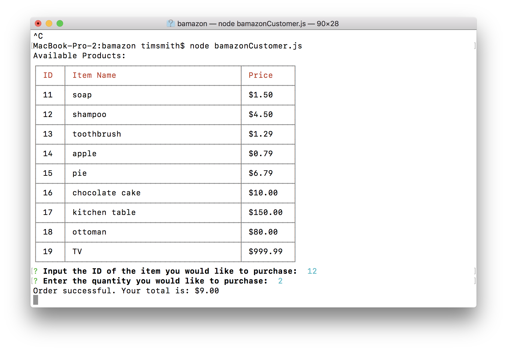
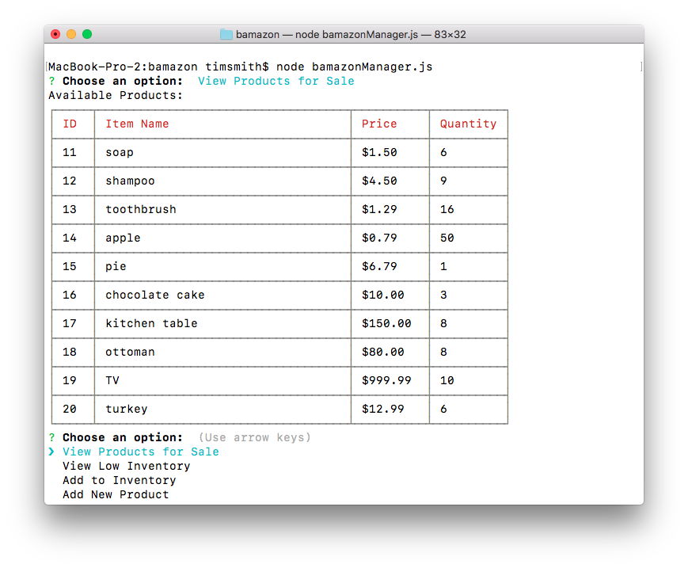

# bamazon
Bamazon is an online store that is composed of 3 separate applications:
* bamazonCustomer allows customers to buy items from the store
* bamazonManager allows managers to add items to the store and manage inventory levels
* bamazonSupervisor allows supervisors to view departmental profits or losses

## bamazonCustomer
Upon startup, bamazonCustomer will display a list of items and their prices.  The user
should simply enter the id of the desired item at the prompt, and then enter the desired
quantity.  If sufficient quantity is in stock, the user will get a success message indicating 
the total price like this:

If insufficient quantity is in stock, the user will get an error like this:

## bamazonManager
bamazonManager presents the user with a menu of four choices:
* View Products for Sale
* View Low Inventory
* Add to Inventory
* Add New Product

### View Products for Sale
This feature shows the manager all products in the inventory, including their prices and stocked quantities like this:

### View Low Inventory
This feature shows the manager which products have fewer than five items in current inventory.

### Add to Inventory
This feature prompts the manager to enter the item number for which new inventory has been added, and then the amount of new inventory.
For example, if 12 new turkeys arrived on store shelves, the manager program would show this:

### Add New Product
This feature prompts the manager to add all info needed to add a new product into the database. 
For example, if the grocery department were to start carrying milk, the program flow would look like this:

## bamazonSupervisor
bamazonSupervisor enables the supervisor to track the profitability of each department.  Upon startup, the supervisor
will have the choice of viewing the current profitability chart, or adding new departments.  The supervisor must add 
each department before the table will contain complete information, and the department names __must__ match the names
used in the product table (i.e., the department name must match the name given when items were added in the manager tool.)
Once all departments have been added, the supervisor can select the option to view the department profitabiliy table, which 
will look like this:

